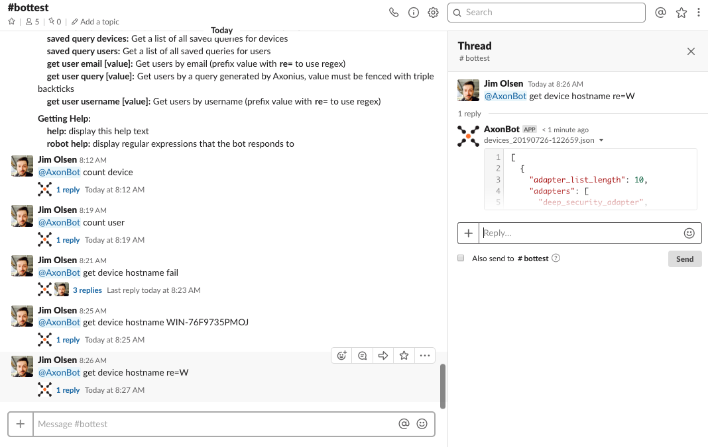
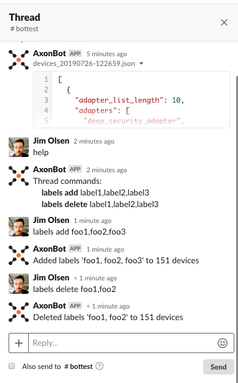
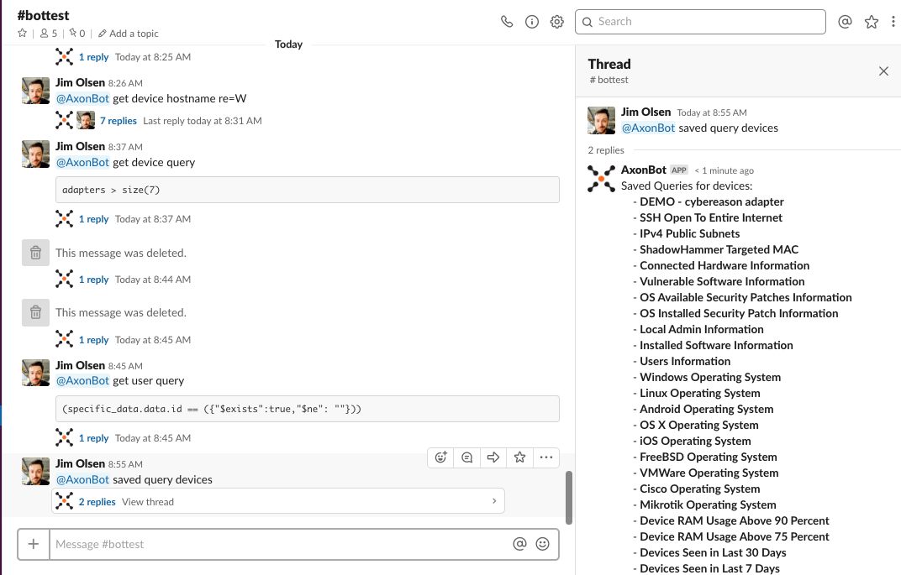
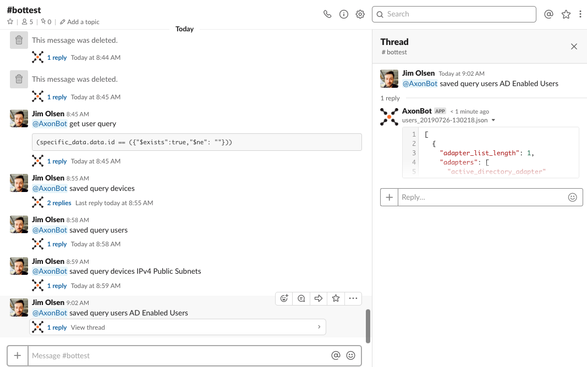
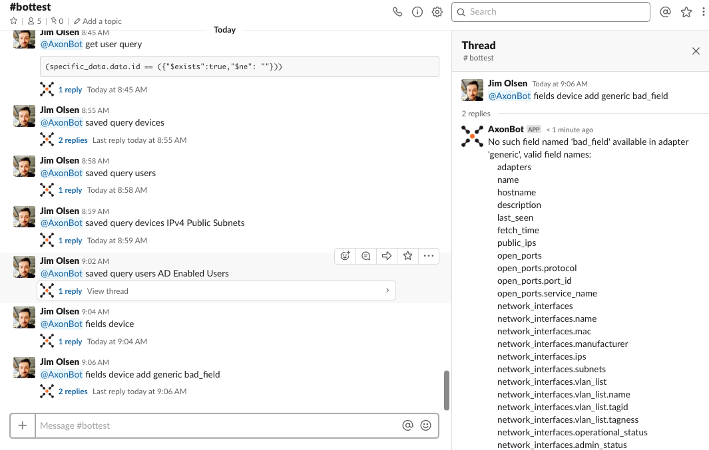
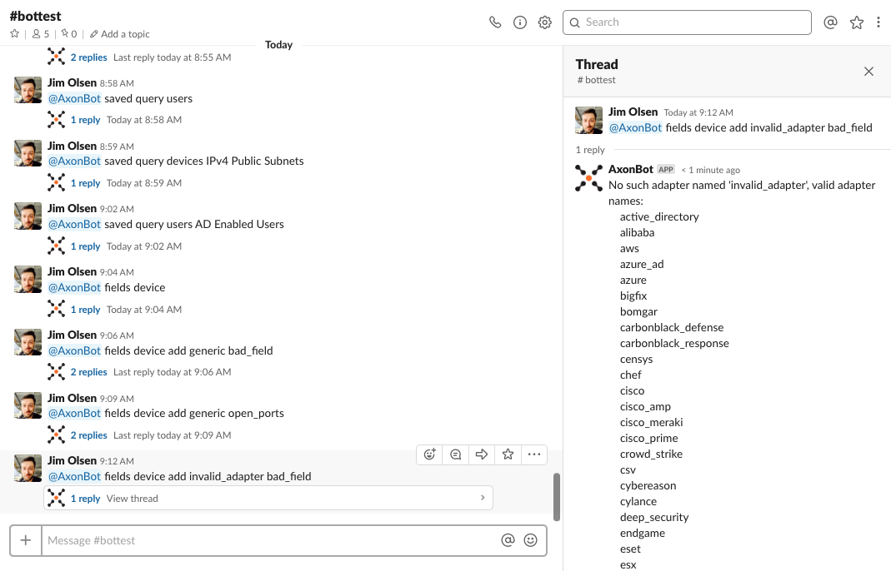
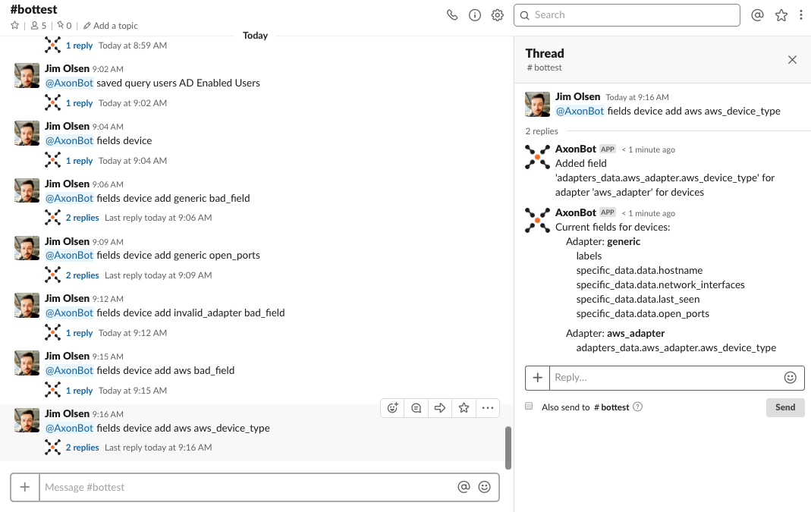
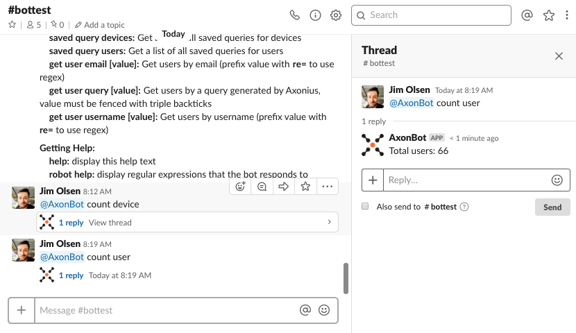

<!-- MarkdownTOC -->

- [Using AxonBot](#using-axonbot)
- [help](#help)
- [get command response examples](#get-command-response-examples)
    - [object not found](#object-not-found)
    - [object found](#object-found)
    - [objects using regex](#objects-using-regex)
- [Thread sub-commands](#thread-sub-commands)
    - [Thread help](#thread-help)
    - [Thread labels add](#thread-labels-add)
    - [Thread labels delete](#thread-labels-delete)
- [get commands](#get-commands)
    - [get device commands](#get-device-commands)
        - [get device hostname](#get-device-hostname)
        - [get device ip](#get-device-ip)
        - [get device mac](#get-device-mac)
        - [get device query](#get-device-query)
    - [get user commands](#get-user-commands)
        - [get user username](#get-user-username)
        - [get user email](#get-user-email)
        - [get user query](#get-user-query)
- [saved query commands](#saved-query-commands)
    - [saved query devices](#saved-query-devices)
    - [saved query users](#saved-query-users)
    - [saved query devices query_name](#saved-query-devices-query_name)
    - [saved query users query_name](#saved-query-users-query_name)
- [fields device commands](#fields-device-commands)
    - [fields device](#fields-device)
    - [fields device add generic invalid_field](#fields-device-add-generic-invalid_field)
    - [fields device add generic valid_field](#fields-device-add-generic-valid_field)
    - [fields device add invalid_adapter invalid_field](#fields-device-add-invalidadapter-invalidfield)
    - [fields device add valid_adapter invalid_field](#fields-device-add-validadapter-invalidfield)
    - [fields device add valid_adapter valid_field](#fields-device-add-validadapter-validfield)
    - [fields device delete generic invalid_field](#fields-device-delete-generic-invalid_field)
    - [fields device delete generic valid_field](#fields-device-delete-generic-valid_field)
    - [fields device delete invalid_adapter invalid_field](#fields-device-delete-invalidadapter-invalidfield)
    - [fields device delete valid_adapter invalid_field](#fields-device-delete-validadapter-invalidfield)
    - [fields device delete valid_adapter valid_field](#fields-device-delete-validadapter-validfield)
- [fields user commands](#fields-user-commands)
    - [fields user](#fields-user)
    - [fields user add generic invalid_field](#fields-user-add-generic-invalid_field)
    - [fields user add generic valid_field](#fields-user-add-generic-valid_field)
    - [fields user add invalid_adapter invalid_field](#fields-user-add-invalidadapter-invalidfield)
    - [fields user add valid_adapter invalid_field](#fields-user-add-validadapter-invalidfield)
    - [fields user add valid_adapter valid_field](#fields-user-add-validadapter-validfield)
    - [fields user delete generic invalid_field](#fields-user-delete-generic-invalid_field)
    - [fields user delete generic valid_field](#fields-user-delete-generic-valid_field)
    - [fields user delete invalid_adapter invalid_field](#fields-user-delete-invalidadapter-invalidfield)
    - [fields user delete valid_adapter invalid_field](#fields-user-delete-validadapter-invalidfield)
    - [fields user delete valid_adapter valid_field](#fields-user-delete-validadapter-validfield)
- [count commands](#count-commands)
    - [count device](#count-device)
    - [count user](#count-user)

<!-- /MarkdownTOC -->

# Using AxonBot

You can either direct message the bot, or you can invite it to a channel by using @axonbot (or whatever you named the bot).

# help 

This will print out a list of commands that the bot will accept.


# get command response examples

Examples of thread responses for all get commands.

## object not found

Example when a object is not found.


## object found

Example when an object is found.


## objects using regex

Example of using a regex to find objects - valid for all get commands except *query*.



# Thread sub-commands

Examples of thread sub-commands that can be used in the thread response for all get commands.

## Thread help

Example of getting sub-commands that can be used in a thread where objects were returned.


## Thread labels add

Example of adding labels to objects that were returned.


## Thread labels delete

Example of removing labels from objects that were returned.



# get commands

These will all reply to you in a thread with a JSON snippet of matching objects. See [get command response examples](#get-command-response-examples) for examples of what the thread responses will look like, and see [Thread sub-commands](#thread-sub-commands) for examples of using sub-commands in the thread responses.

## get device commands
### get device hostname
### get device ip
### get device mac
### get device query

This lets you use a query from the Axonius GUI to get objects. You need to enclose the query using backticks ala ```` @AxonBot get device query ```adapters > size(7)``` ````.


## get user commands

These all work exactly like [get device commands](#get-device-commands).

### get user username
### get user email
### get user query

# saved query commands

Commands to get objects in a thread response using saved queries.

## saved query devices

This will respond to you in a thread with a list of all Saved Queries for devices.



## saved query users

This will respond to you in a thread with a list of all Saved Queries for users.


## saved query devices query_name

This will all reply to you in a thread with a JSON snippet of all devices returned for the query given as query_name. See [get command response examples](#get-command-response-examples) for examples of what the thread responses will look like, and see [Thread sub-commands](#thread-sub-commands) for examples of using sub-commands in the thread responses.


## saved query users query_name

This works exactly like [saved query devices query_name](#saved-query-devices-query_name).



# fields device commands

These commands let you add, remove, or list the fields that will be returned for objects.

## fields device

List all of the fields that will be returned in JSON snippets for get commands against devices.


## fields device add generic invalid_field

Try to add an invalid generic field to the fields that will be returned in JSON snippets for get commands against devices. This will respond with a list of all valid generic fields in a thread.



## fields device add generic valid_field

Add a valid generic field to the fields that will be returned in JSON snippets for get commands against devices. 


## fields device add invalid_adapter invalid_field

Try to add a field for an invalid adapter to the fields that will be returned in JSON snippets for get commands against devices. This will respond with a list of all valid adapters in a thread.



## fields device add valid_adapter invalid_field

Try to add an invalid field for a valid adapter to the fields that will be returned in JSON snippets for get commands against devices. This will respond with a list of all valid fields for the adapter in a thread.


## fields device add valid_adapter valid_field

Add a valid field for a valid adapter to the fields that will be returned in JSON snippets for get commands against devices. 



## fields device delete generic invalid_field

This works exactly like the add command, but removes it from the fields that will be returned for devices.

## fields device delete generic valid_field

This works exactly like the add command, but removes it from the fields that will be returned for devices.

## fields device delete invalid_adapter invalid_field

This works exactly like the add command, but removes it from the fields that will be returned for devices.

## fields device delete valid_adapter invalid_field

This works exactly like the add command, but removes it from the fields that will be returned for devices.

## fields device delete valid_adapter valid_field

This works exactly like the add command, but removes it from the fields that will be returned for devices.

# fields user commands

These all work exactly like [fields device commands](#fields-device-commands).

## fields user
## fields user add generic invalid_field
## fields user add generic valid_field
## fields user add invalid_adapter invalid_field
## fields user add valid_adapter invalid_field
## fields user add valid_adapter valid_field
## fields user delete generic invalid_field
## fields user delete generic valid_field
## fields user delete invalid_adapter invalid_field
## fields user delete valid_adapter invalid_field
## fields user delete valid_adapter valid_field

# count commands

## count device

This will reply to you in a thread the total number of all devices in the system.


## count user

This will reply to you in a thread the total number of all users in the system.


