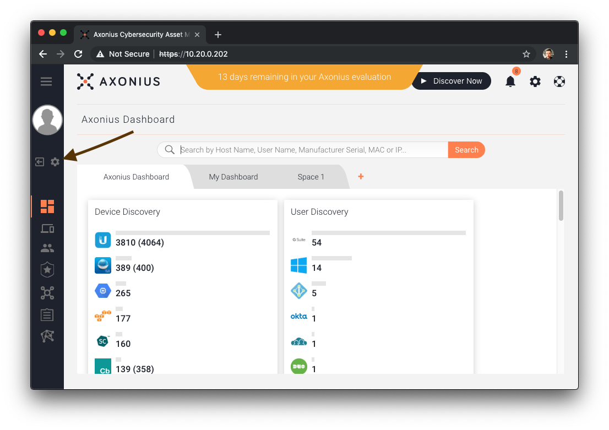
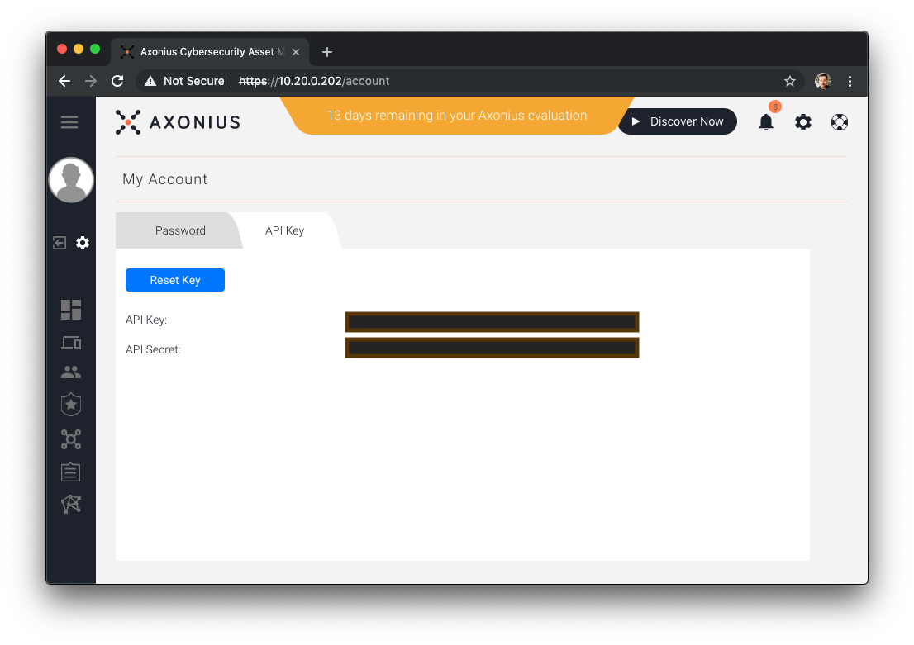

<!-- MarkdownTOC -->

- [AxonBot Axonius Setup](#axonbot-axonius-setup)
    - [Navigate to the Account settings for an Axonius user](#navigate-to-the-account-settings-for-an-axonius-user)
    - [Get the Axonius URL, API Key token, and API Secret token](#get-the-axonius-url-api-key-token-and-api-secret-token)

<!-- /MarkdownTOC -->

# AxonBot Axonius Setup

AxonBot requires the URL to an Axonius instance, and the API Key and API Secret for a user in Axonius.

## Navigate to the Account settings for an Axonius user

Click the gear icon on the left hand toolbar.

## Get the Axonius URL, API Key token, and API Secret token

Copy the "API Key" and "API Secret" fields. These are the tokens that you will need to provide to the axonbot as AX_KEY and AX_SECRET, respectively. You will also need to copy the URL of your axonius instance, which you will need to provide to the axonbot as AX_URL.

