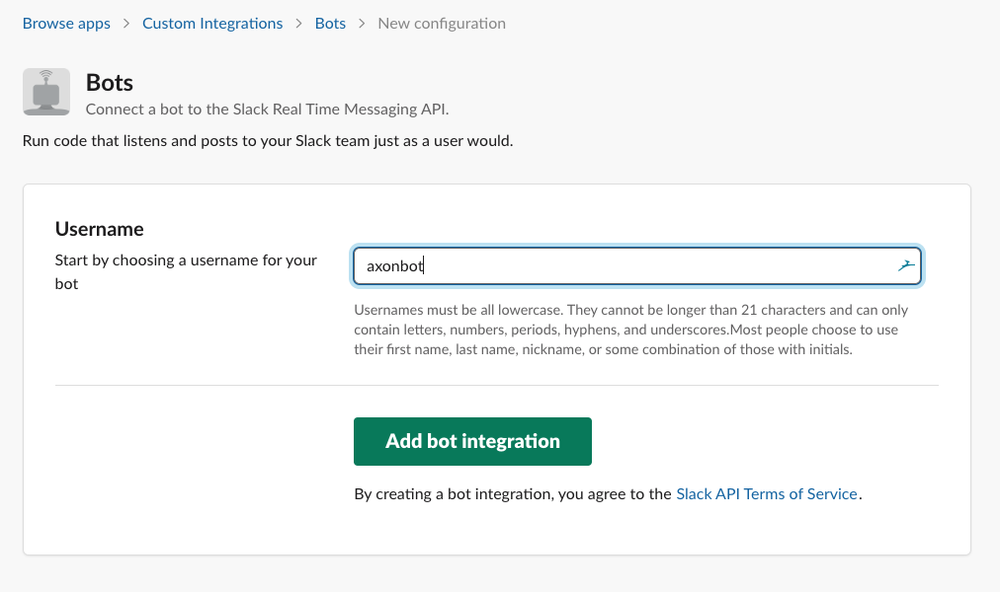
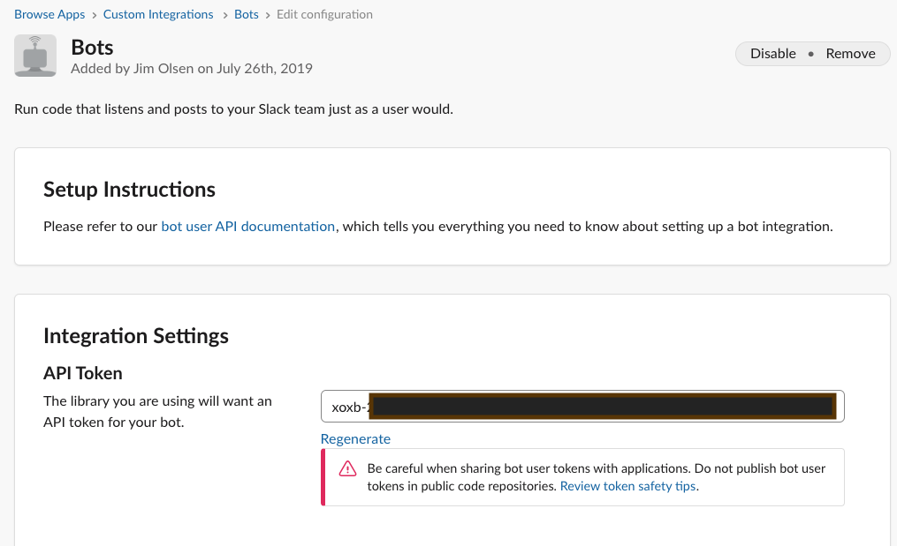
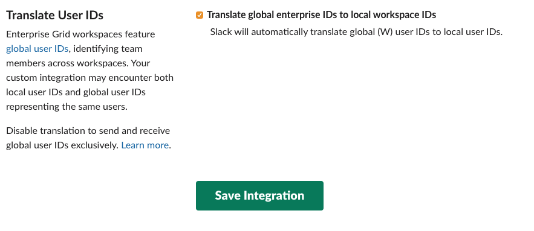
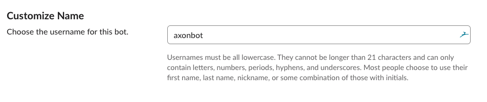
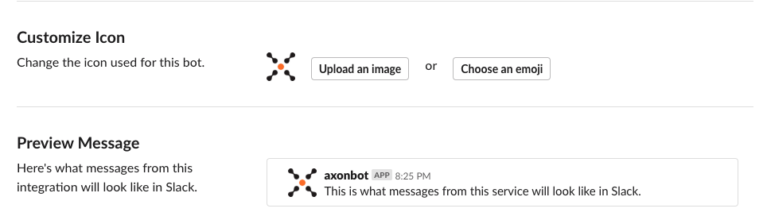
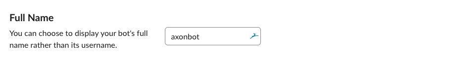
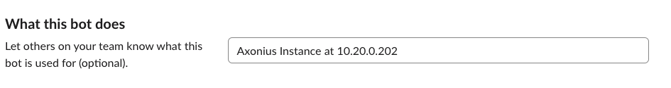
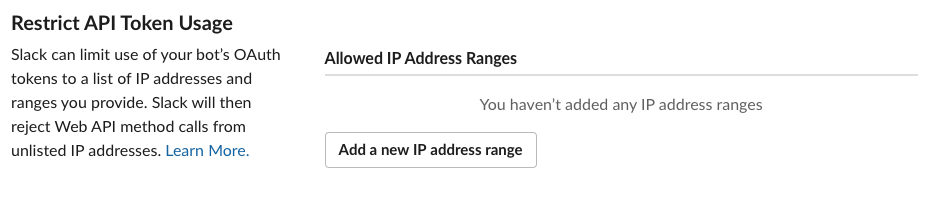

.. include:: .special.rst

Steps to generate an API token for a Slack bot
#####################################################

Create a new Slack bot
=====================================================
Go to https://my.slack.com/services/new/bot and fill in the :blue:`Username` field (i.e. axonbot), then click :blue:`Add bot integration`.

Get the API token for the New Slack Bot
=====================================================
The :blue:`API Token` field that starts with :blue:`xoxb-` is what you need to provide as :ref:`SLACK_API_TOKEN`.

Save Integration
=====================================================
You can do the optional items below.

Or you can skip all of that and scroll to the bottom of the page and click the :blue:`Save Integration` button.

Optional Items
=====================================================
You can change the name of the bot here.

Customize Icon
-----------------------------------------------------
Click the :blue:`Upload an image` button and supply `this icon <_static/images/axlogo512.png>`_.

Full Name
-----------------------------------------------------
You can change the display name of the bot here.

What this bot does
-----------------------------------------------------
This is a good place to put the Axonius instance this bot works with.

Restrict API Token Usage
-----------------------------------------------------
You can fill this in so that the API Token for this bot user can only connect from a specific IP Address range.

