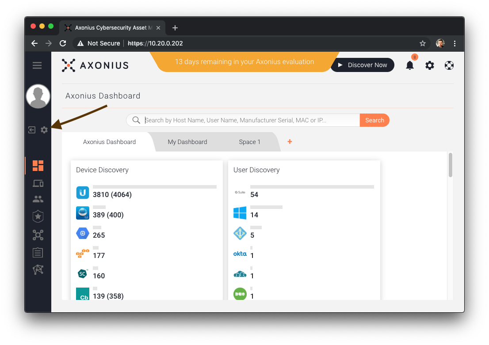
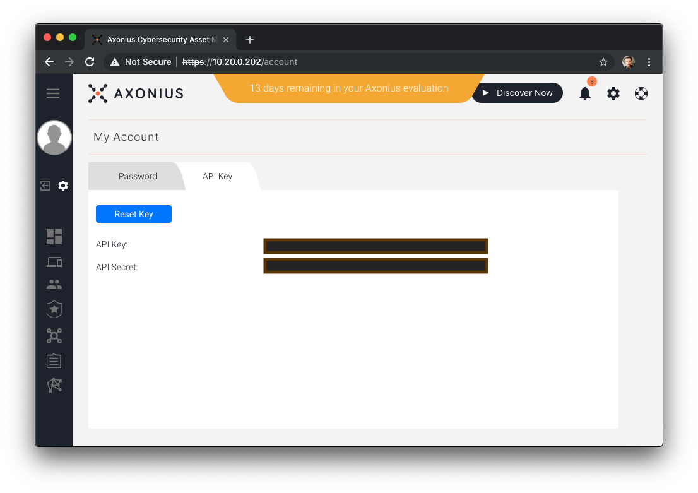

.. include:: .special.rst

Steps to get an Axonius API Key and API Secret
#####################################################

Navigate to the Account settings for a user in Axonius
======================================================
The URL is what you need to provide as :ref:`AX_URL`.

Click the gear icon on the left hand toolbar.

Get the Axonius URL, API Key token, and API Secret token
========================================================

The ``API Key`` field is what you need to provide as :ref:`AX_KEY`.

The ``API Secret`` field is what you need to provide as :ref:`AX_SECRET`.

