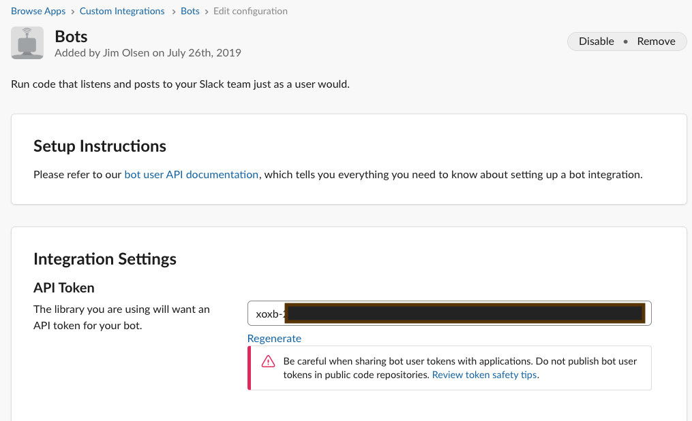
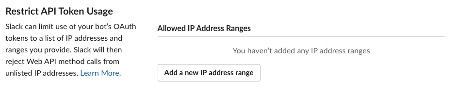

<!-- MarkdownTOC -->

- [AxonBot Slack Setup](#axonbot-slack-setup)
    - [Create a Slack Bot](#create-a-slack-bot)
    - [Get the Slack API token](#get-the-slack-api-token)
    - [Save Integration](#save-integration)
    - [Optional Configurations](#optional-configurations)
        - [Customize Name](#customize-name)
        - [Customize Icon](#customize-icon)
        - [Full Name](#full-name)
        - [What this bot does](#what-this-bot-does)
        - [Restrict API Token Usage](#restrict-api-token-usage)

<!-- /MarkdownTOC -->

# AxonBot Slack Setup

AxonBot requires a Slack API Bot token. Here are the steps to generate one for your workspace.

## Create a Slack Bot

Go to https://my.slack.com/services/new/bot and fill in the Username field (i.e. axonbot), then click "Add bot integration".


## Get the Slack API token

The next page will have an API Token field that starts with ```xoxb-```. This is the token that you will need to provide to axonbot as SLACK_API_TOKEN.



## Save Integration

You can fill out the [Optional Configurations](#optional-configurations) below, or you can skip all of that and scroll to the bottom of the page and click the "Save Integration" button.


## Optional Configurations

### Customize Name

You can change the name of the bot in slack here.


### Customize Icon

Click the "Upload an image" button and supply [this icon](axlogo512.png).


### Full Name

You can change the display name of the bot in slack here.


### What this bot does

This is a good place to put the Axonius instance this bot works with.


### Restrict API Token Usage

You can fill this in so that the API Token for this bot user can only connect from a specific IP Address range.



