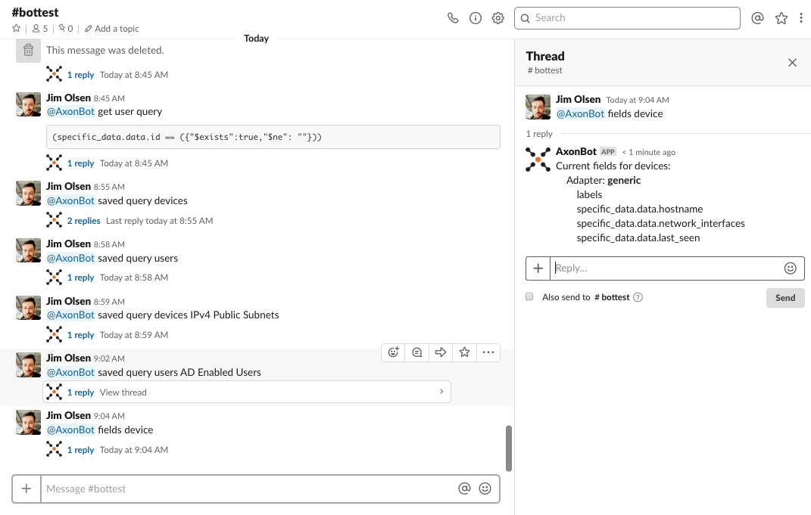
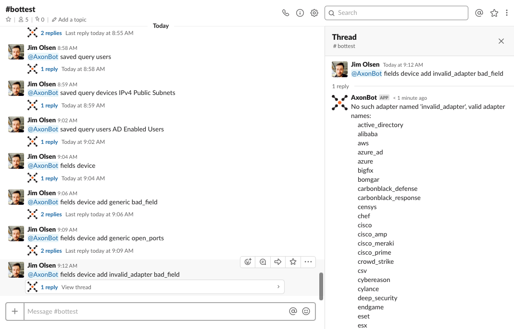
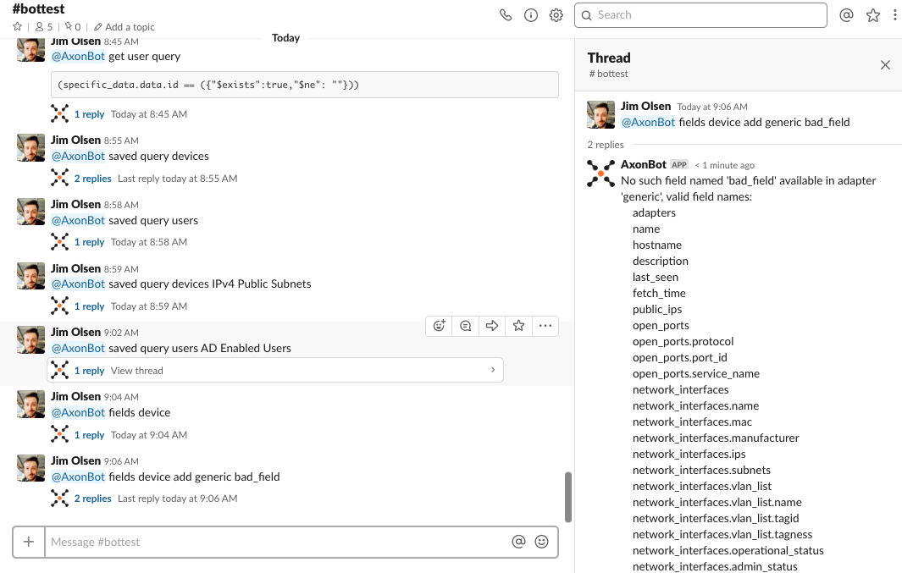

.. include:: .special.rst

Fields commands
#####################################################
These commands let you add, remove, or list the fields (columns) that will be returned for objects.

List fields
====================================================
* :blue:`fields device`: Reply to you in a thread with a list of all fields that will be returned in device responses.
* :blue:`fields user`: Reply to you in a thread with a list of all fields that will be returned in user responses.

Add fields
====================================================
* :blue:`fields device add [ADAPTER] [FIELD]`: Add a field for a given adapter to the fields that will be returned in device responses.
* :blue:`fields user add [ADAPTER] [FIELD]`: Add a field for a given adapter to the fields that will be returned in user responses.

Delete fields
====================================================
* :blue:`fields device delete [ADAPTER] [FIELD]`: Remove a field for a given adapter from the fields that will be returned in device responses.
* :blue:`fields user delete [ADAPTER] [FIELD]`: Remove a field for a given adapter from the fields that will be returned in user responses.

Errors with adding or deleting fields
====================================================

If the adapter supplied is not "generic" or a valid adapter name, it will reply to you in a thread with a list of valid adapter names.

|br|

If the field supplied for the adapter is not a valid field name, it will reply to you in a thread with a list of valid fields for that adapter.

