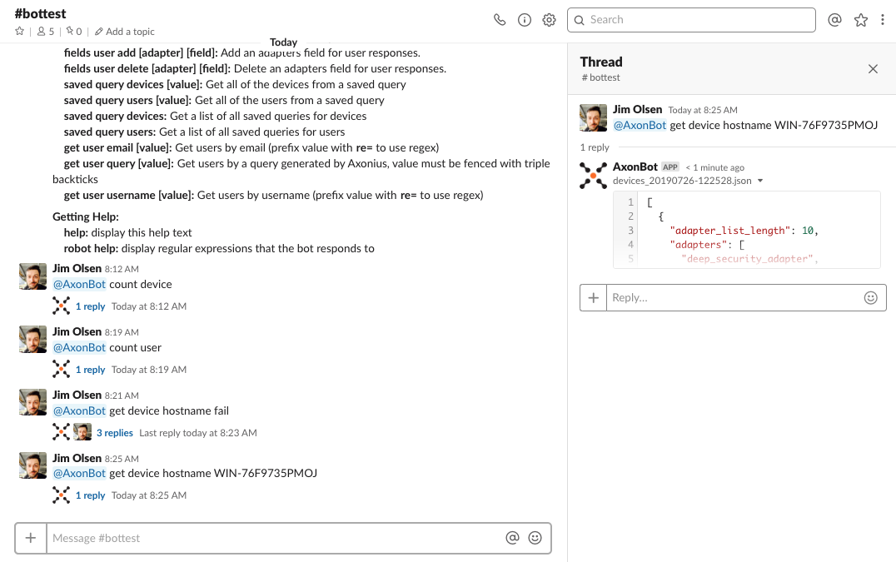
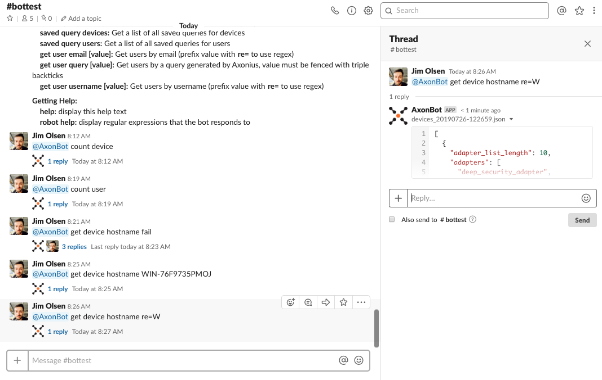
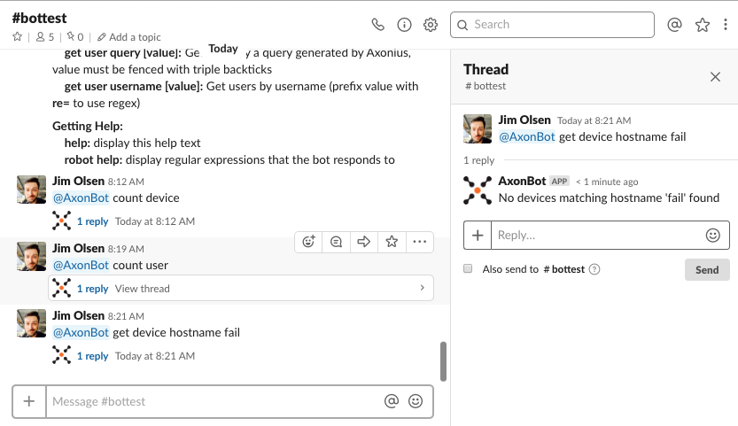

.. include:: .special.rst

Thread Example Responses
#####################################################
Examples of thread responses for all get commands.

The thread response will contain a JSON snippet or a JSON file attachment depending on the size of the JSON response.

Found response
====================================================
Example of a thread response when a object is found.

Found response using regex
====================================================
Example of using a regex to find objects by prefixing the value with :blue:`re=`

Valid for all get commands except *get device query* and *get user query*.

Not found response
====================================================
Example of a thread response when a object is not found.

