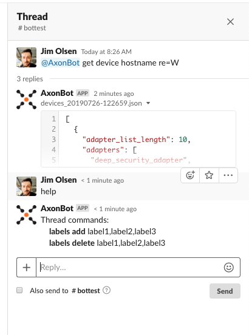
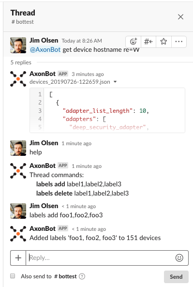
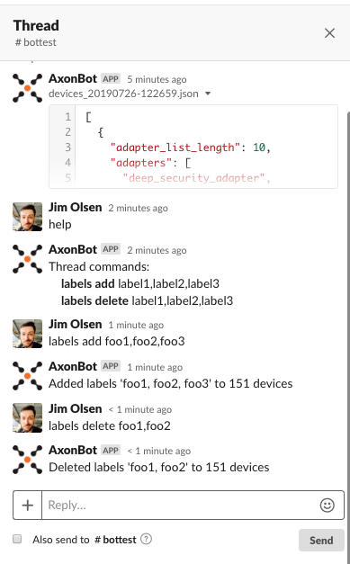

.. include:: .special.rst

Thread sub-commands
#####################################################
Examples of thread sub-commands that can be used in the thread response for all get commands.

Thread help
====================================================
Example of getting sub-commands that can be used in a thread where objects were returned.

Thread labels add
====================================================
Example of adding labels to objects that were returned.

Thread labels delete
====================================================
Example of removing labels from objects that were returned.

