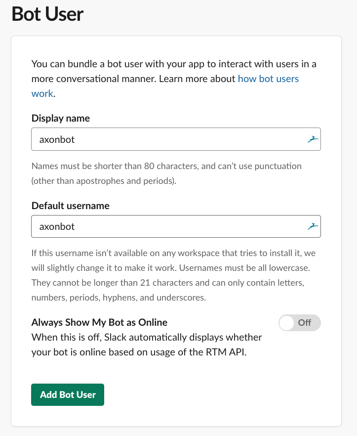
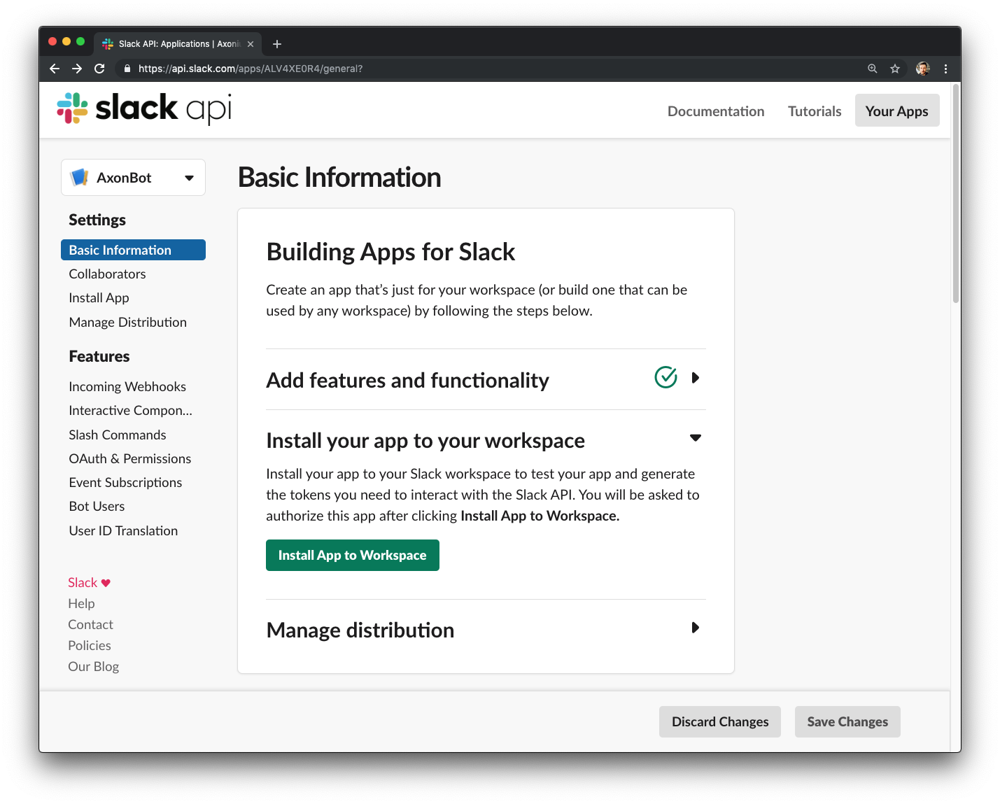
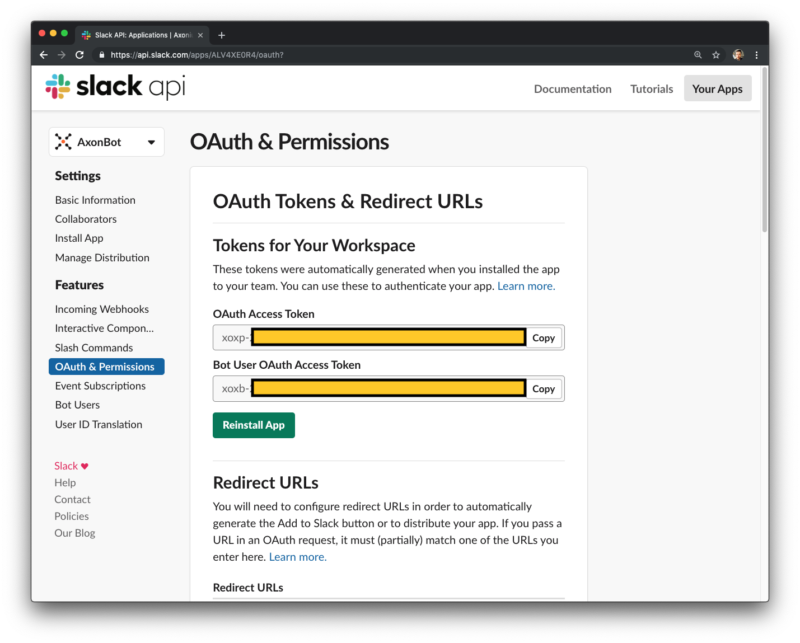

# AxonBot Slack Setup

AxonBot requires a Slack API Bot token. Here are the steps to generate one for your workspace.

## Create a Slack application

Go to https://api.slack.com/apps and click "Create an App".

Fill in the App Name field with something (i.e. AxonBot) and choose the Slack Workspace you want the bot to have access to and click "Create App".

You will be taken to a "Basic Information" page for the new Slack Bot. Click on the "Bots" box under "Add features and funtionality".

Click "Add a Bot User".

Change the values as you see fit, or accept the defaults and click "Add Bot User".

Click "Basic Information" on the left hand side, then under "Install your app to your workspace" click the "Install App to Workspace" button.

Click the "Confirm button" to authorize the bot user to access your workspace.

Optionally, click "Basic Information" on the left hand side and scroll down to "Display Information". Fill in the "Short Description" field. Click the "+ Add App Icon" button and supply [this icon](axlogo512.png). Change the background color as you like, then click the "Save Changes" button on the bottom.

Finally, click "OAuth & Permissions" on the left hand side, and copy the string that starts with "xoxb-" from the "Bot User OAuth Access Token" field. This is the token that you will need to provide to the axonbot as SLACK_API_TOKEN.

